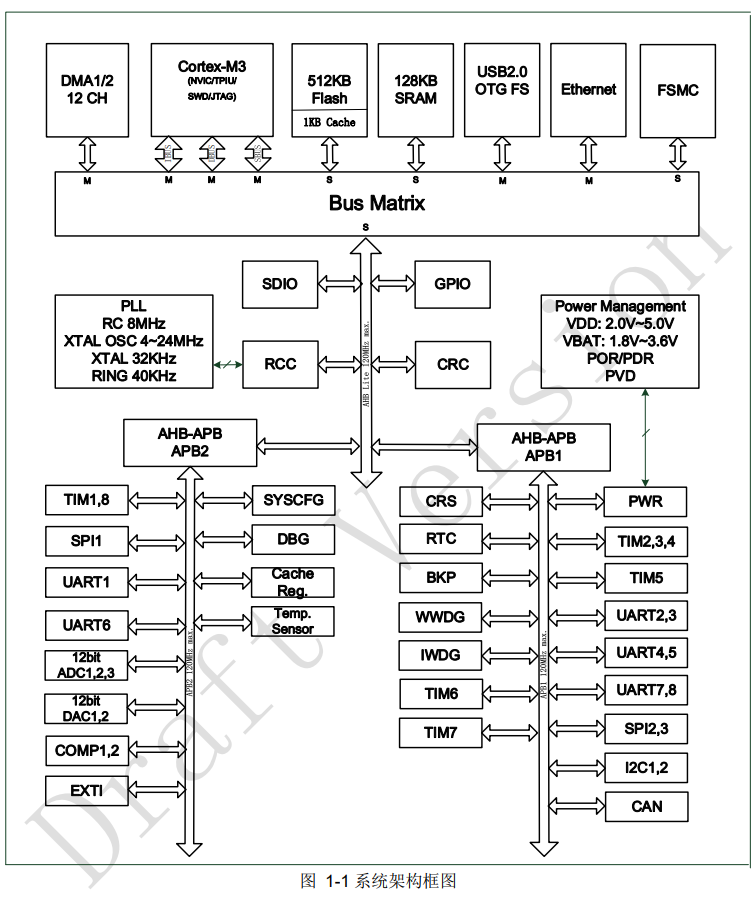
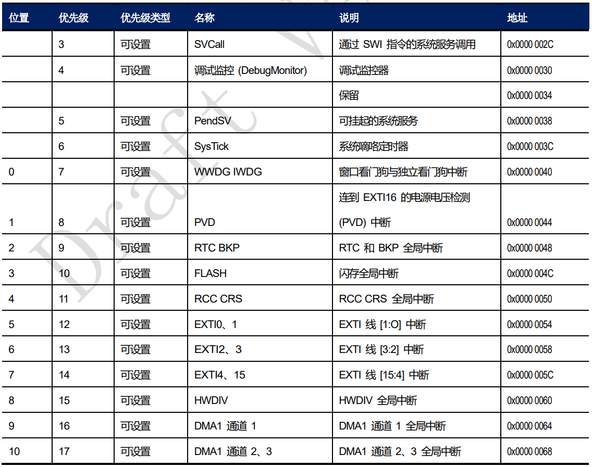
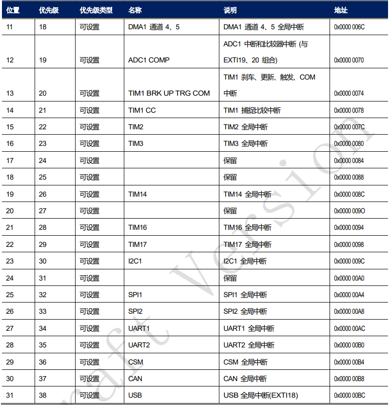

# 用户手册 重要信息 #

RTC

中断向量表 P156

## 定时器

- 高级定时器 TIM1/8
  - 计数器：16位，递增、递减、递增/递减，自动重装载
  - 预分频器：16 位可实时编程
  - 输入捕获：输入信号的脉冲宽度、周期的测量
  - PWM 输出（死区时间可调）（边沿对齐或中央对齐模式）
  - 支持编码器、霍尔传感器等接口
  - 外部时钟模式 1（外部输入引脚 TIx）
  - 外部时钟模式 2（外部触发输入 ETR）
  - 从模式
    - 复位模式，发生触发输入事件会使计数器清零重启
    - 门控模式，输入为高时计数，低时暂停
    - 触发模式，在输入的上升沿启动计数，之后不停止

- 16位通用计时器 TIM3/4
  - 计数器：16位，递增、递减、递增/递减，自动重装载
  - 预分频器：16 位可实时编程
  - 输入捕获：输入信号的脉冲宽度、周期的测量
  - PWM 输出（死区时间可调）（边沿对齐或中央对齐模式）
  - 支持编码器、霍尔传感器等接口
  - 外部时钟模式 1（外部输入引脚 TIx）
  - 外部时钟模式 2（外部触发输入 ETR）
  - 从模式
    - 复位模式，发生触发输入事件会使计数器清零重启
    - 门控模式，输入为高时计数，低时暂停
    - 触发模式，在输入的上升沿启动计数，之后不停止
    - 外部时钟模式 2+触发模式

- 32 位定时器（TIM2/5）
  - 计数器：32位，递增、递减、递增/递减，自动重装载
  - 预分频器：16 位可实时编程
  - 输入捕获：输入信号的脉冲宽度、周期的测量
  - PWM 输出（死区时间可调）（边沿对齐或中央对齐模式）
  - 支持编码器、霍尔传感器等接口
  - 外部时钟模式 1（外部输入引脚 TIx）
  - 外部时钟模式 2（外部触发输入 ETR）
  - 从模式
    - 复位模式，发生触发输入事件会使计数器清零重启
    - 门控模式，输入为高时计数，低时暂停
    - 触发模式，在输入的上升沿启动计数，之后不停止
    - 外部时钟模式 2+触发模式

- 基本定时器（TIM6/7）
  - 计数器：16位，递增，自动重装载
  - 预分频器：16 位可实时编程
  - 计数器的时钟源只有一种：内部时钟（INT_CK）

